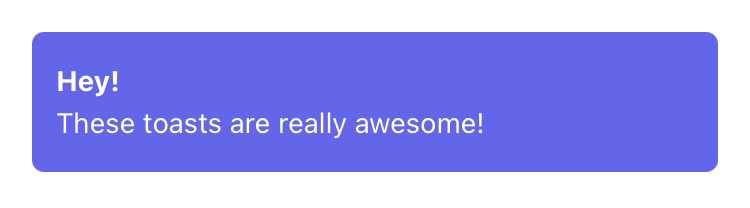

# awesome-toasts

Create awesome toasts for your React Native app easily!

## Installation

```sh
npm install awesome-toasts
```

```sh
yarn add awesome-toasts
```

## Usage

We highly recommend using typescript!

Create your Toast component

```ts
// components/Toast.tsx
import React from 'react';

import { Text, View } from 'react-native';

import tw from 'tailwind-rn';

type ToastProps = {
  title?: string;
  description: string;
};

export const Toast: React.FC<ToastProps> = ({ title, description }) => (
  <View style={tw('px-3 py-4 m-4 bg-indigo-500 rounded-md')}>
    <Text style={tw('font-bold text-white mb-1')}>{title}</Text>
    <Text style={tw('text-white')}>{description}</Text>
  </View>
);
```



Create your toasts hook

```ts
// hooks/toasts.ts
import { createUseToastsHook } from 'awesome-toasts';

import { Toast } from '../components/toast';

export const useToasts = createUseToastsHook<typeof Toast>();
```

Include the ToastsProvider in your App component

```ts
import React from 'react';

import { ToastsProvider } from 'awesome-toasts';

import { Toast } from './components/toast';

export function App() {
  return (
    <ToastsProvider component={Toast}>
      {/* Your stuff goes here */}
    </ToastsProvider>
  );
}
```

And you are ready to show some awesome toasts!

```ts
const { showToast } = useToasts();

showToast({
  props: {
    title: 'Hey!',
    description: 'These toasts are really awesome!',
  },
  duration: 4000, // ms
});
```

Toasts get dismissed after the duration time has passed. You can also dismiss it swiping it up!

Everything is correctly typed for a great developer experience ;)

Have fun!

## TO-DO

- [ ] Bottom position support (In progess)
- [ ] Add tests

## Contributing

See the [contributing guide](CONTRIBUTING.md) to learn how to contribute to the repository and the development workflow.

## License

MIT
